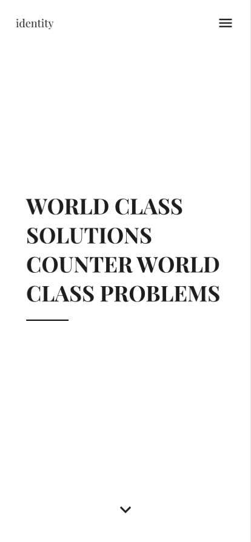
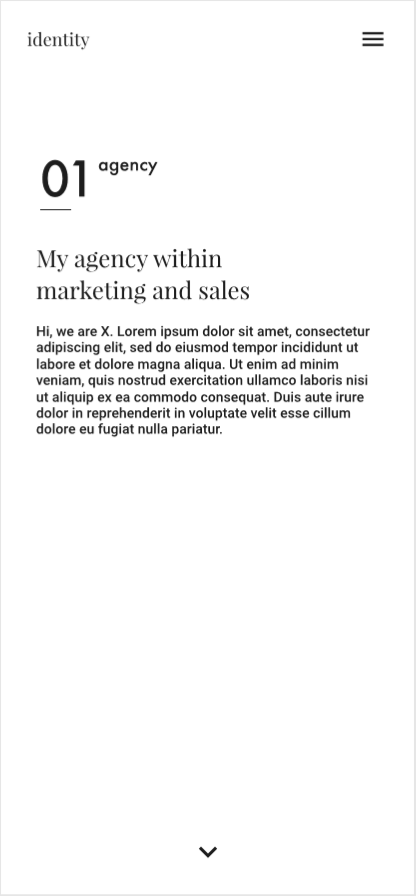
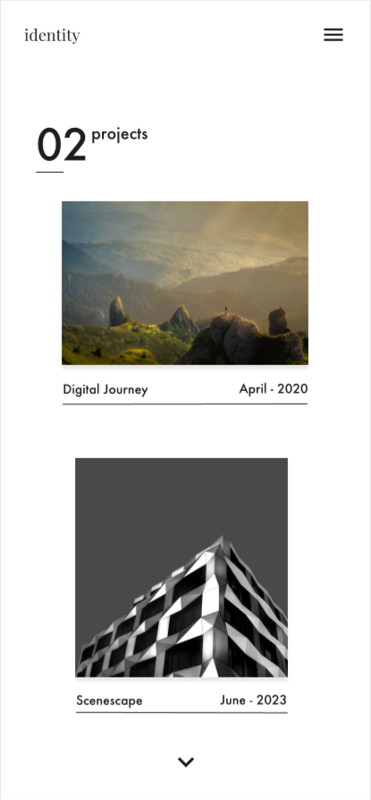
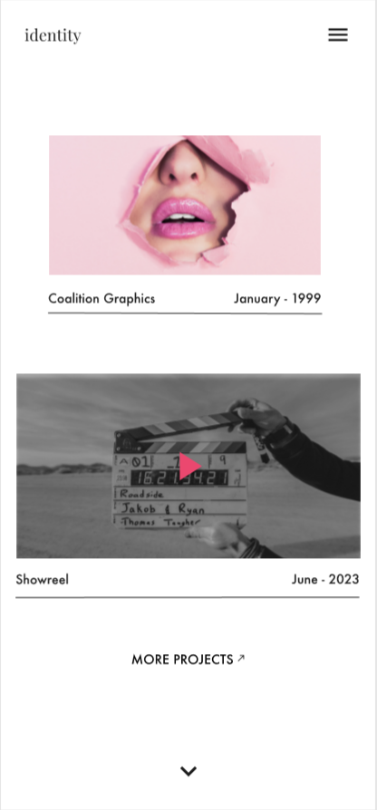
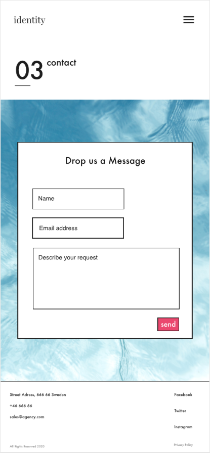
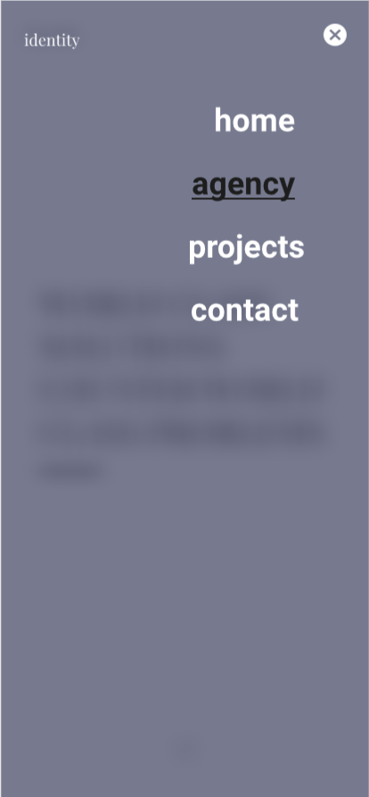

# Robin Westerback Full Stack Web Developer
User Centric Frontend Development Milestone Project @ Code Institute

This project will function as my portfolio website to show for potential clients/employers. It provides information about me and what I can offer. 
The website showcases 4 projects, provides social links (GitHub and LinkedIn), my resumé and contact information. You can find the website [here](https://robinwesterback.github.io/User-Centric-Frontend-Development-Milestone-Project/).

## UX
The website is designed to be easy to use, simple and clean with the purpose to present all information in a visually appealing manner on all devices.
It is made for potential clients/employers who’s looking for talent like me. They want to know  who I am, what I can offer, what I have done and how to contact me.
To provide that information this website is a simple and straightforward one-pager with 4 major sections - Home, About, Projects and Contact.
The footer at the end of the page contains links for social links and a resume. 

### User Stories
The user stories are showing pictures from the mockups and not the actual project. 
You can access the actual project [here](https://robinwesterback.github.io/User-Centric-Frontend-Development-Milestone-Project/) to try the user stories yourself.
As a potential client/employer, I want to know who you are and what you can offer to get an idea if you have what I seek. 

 

Then I want to know what you have done in the past to back that up and qualify that I should contact you.

 

I want to be able to contact you and send a request to get in touch. I want to be able to find social links, a resume and navigate easily on the website in case I want to go back to another section. 

 

## Features
The website contains several features with a few left to be implemented.

### Existing Features

#### Full screen Overlay Navigation from w3schools on mobile and iPad
I used the information from [w3schools](https://www.w3schools.com/howto/howto_js_fullscreen_overlay.asp "How To JS Fullscreen Overlay") to create a full screen overlay navigation with a blur. I use the background-filter: blur element which doesn’t get validated by the jigsaw CSS validator. I have made the background opacity 0.9 to make the background less visible on devices that doesn’t support the blur-filter. The color of the logo also changes when you open/close the overlay navigation.

#### Styling span while hovering over the header menu on desktop
I’ve added a styling span while hovering over the header menu on desktop so the border bottom wouldn’t have full width.

#### Contact form with background image from w3schools
I used the information from [w3schools](https://www.w3schools.com/howto/howto_css_form_on_image.asp "How To CSS Form on Image") to create a form with a background image. 
I still have to implement form validation.

#### Links
I provide several links on the website for navigation and resources (social links and resumé) in the header and footer.

### Features Left to Implement

#### Project Modals
I want to add modals for each project with a project title, description with links and an image/video.

#### Separate pages
When my portfolio with projects is big enough I want to create separate about and projects pages to fill the website with more relevant information.

#### 404 error
I want to customize the 404 error webpage

#### Additional languages
As I am swedish it’s possible that I add a swedish version of the page

#### Livechat
It’s possible that I add a live-chat or integrate one from Pipedrive to provide additional ways of communicating with me.

#### Form validation
I need to add a database to record emails and form validation for the form to function properly.

#### Smooth scrolling
I want to add smooth scrolling and arrows to scroll to the next section for a better user experience.

#### Feature showcasing skills
I’m thinking of adding a feature showcasing my skills. For example an icon of HTML or CSS that drops down some interesting information about the skill/me when clicking on it.
It’s a nice and interactive way to provide the information they are interested in.

#### Your thoughts
Are there any features that you would like me to implement to improve the website? Please get in touch and share your thoughts.

## Technologies Used
I used HTML, CSS and Javascript in this project. I tried to stay away from frameworks like bootstrap and JQuery for page speed optimization.

### HTML
This project uses semantic [HTML](https://html.com/) to improve SEO and user friendliness. The HTML is separated using comments.

### CSS
The project uses responsive design to improve the user experience and availability on all devices. The [CSS](https://www.w3.org/Style/CSS/Overview.en.html) is separated using comments. 
I have a [reset stylesheet](https://cssreset.com/scripts/eric-meyer-reset-css/) to reduce browser inconsistencies in things like default line heights, margins and font sizes of headings, and so on. 

### JS
I used [JavaScript](https://www.javascript.com/) to get my full overlay feature to work. I’m looking forward to implement more JavaScript in future releases of the project.

## Testing
I have tested the website and looked for flaws in the design and errors in the functionality on several browsers and devices. 
I have also tested the user stories to see if the website fills its purpose towards the user. 
The expected outcome is that the design is responsive and functional on all browsers/devices. 
Functions like links, overlay menu and contact form should work properly e.g "target=”blank"" where appropriate. Below are my findings and comments.

### Different Browsers and devices

#### Desktop

##### Internet Explorer 
The header has no background when scrolling

##### Mozilla Firefox
"background-filter: blur" doesn’t work

#### Mobile

##### iPhone 7 (Safari & Chrome)
"background-filter: blur" doesn’t work 
The btn text is a little out of place. Added "text-align: center;" to the btn.class but it didn’t solve the problem.
The link to my LinkedIn-profile doesn’t seem to work. I suspect that the link needs to be different for iPhone 7.

### Header
The hover function on the header menu on desktop doesn’t work properly. The menu moves when it only should reveal a span.

### Contact form
All fields are required and work accordingly. When you send you go to a 404 page. Need to setup form validation and style 404 page.

### User stories
The client/employer is provided the information that they seek. They get information about me, what I do, my experience and a picture of me in the about section. 
They get an overview of some of my projects that I have worked on with a link in the image to the website that is related to the project. 
In the contact section they can contact me, take a look at and download my resume as well as checking in my LinkedIn-profile and GitHub-pages. 
In case I want to quickly navigate to different parts of the website there are navigation links in the footer and overlay hamburger menu.

### Conclusion
After all the testing my overall conclusion is that the website is working as intended. 
The minor flaws that exist doesn’t ruin the user experience but should be corrected in the future.

## Deployment
The project is hosted with GitHub pages and deployed from the master branch. When you commit new code to the master branch the website will update automatically. 
To run the project locally, you can clone the repository into your editor by pasting 
"git clone https://github.com/robinwesterback/User-Centric-Frontend-Development-Milestone-Project.git" into your terminal.

## Credits

### Content
All content on the website was written by me.

The Privacy Policy was generated by [Termsfeed](https://www.termsfeed.com/).

### Media
The photos used for this project were delivered by [Megapixel Group](https://www.megapixel.group/) and [Unsplash](https://unsplash.com/).

### Acknowledgements
The Full Screen Overlay Menu was modified using tips from [w3schools](https://www.w3schools.com/howto/howto_js_fullscreen_overlay.asp)

The Contact Form with a background image was modified using tips from [w3schools](https://www.w3schools.com/howto/howto_css_form_on_image.asp)

Eric Meyers Reset can be found [here](https://cssreset.com/scripts/eric-meyer-reset-css/)
